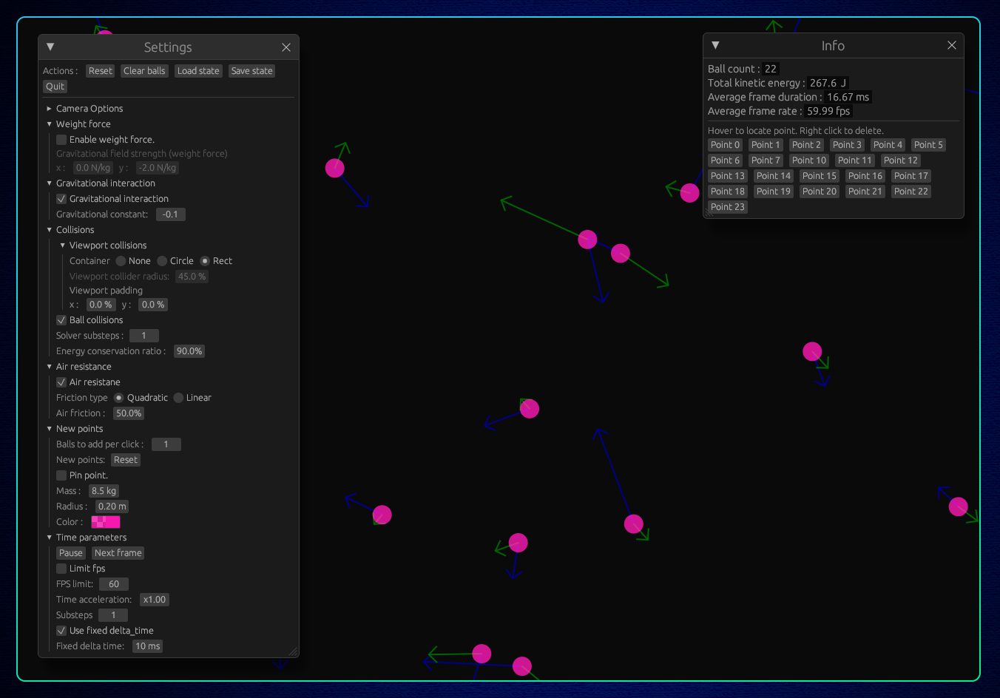

<p align="center">
  
</p>

<p align="center">
  
  
  
  
  

</p>

<p align="center">💠 A physics simulation engine made in Rust, just for fun 💠</p>

<!--  -->

<!-- # Aphex Sim -->
<!---->
<!-- <p align="center"> -->
<!--    -->
<!-- </p> -->
<!---->

# How to install 📥

From [the Github repo](https://github.com/SkwalExe/aphex_sim):

```bash
cargo install --git https://github.com/SkwalExe/aphex_sim
```

You can now start the application with the `aphex_sim` command.

### `cargo` not found?

Cargo is the package manager for rust projects, it can be installed with:

```bash
curl --proto '=https' --tlsv1.2 -sSf https://sh.rustup.rs | sh
```

# Features 🌟

- Various display settings (forces, dark/light theme, acceleration, velocity...)
- Modular time engine (simulation stability)
- Gravitational interaction
- Weight force
- Ball collisions
- Air resistance
